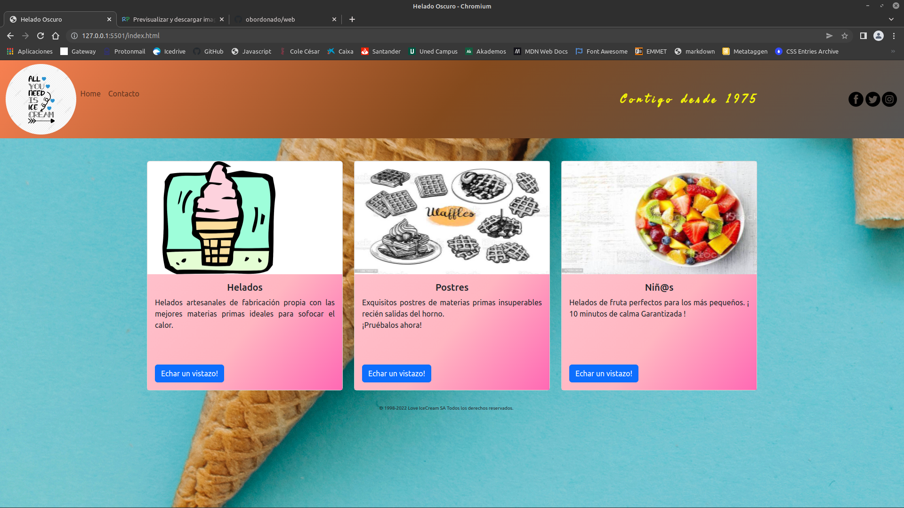
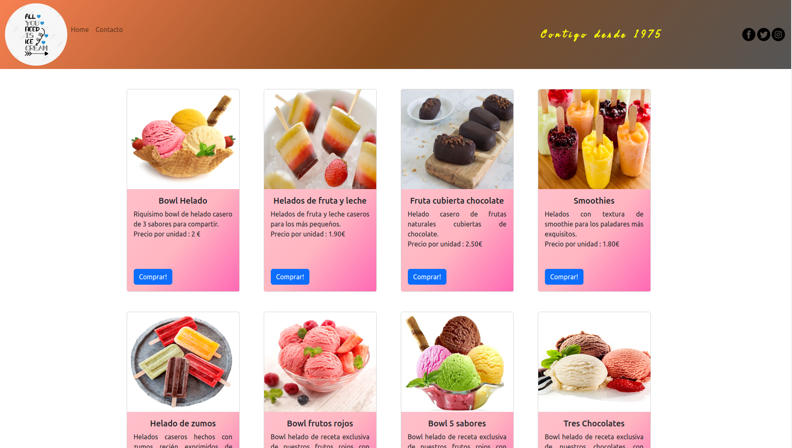
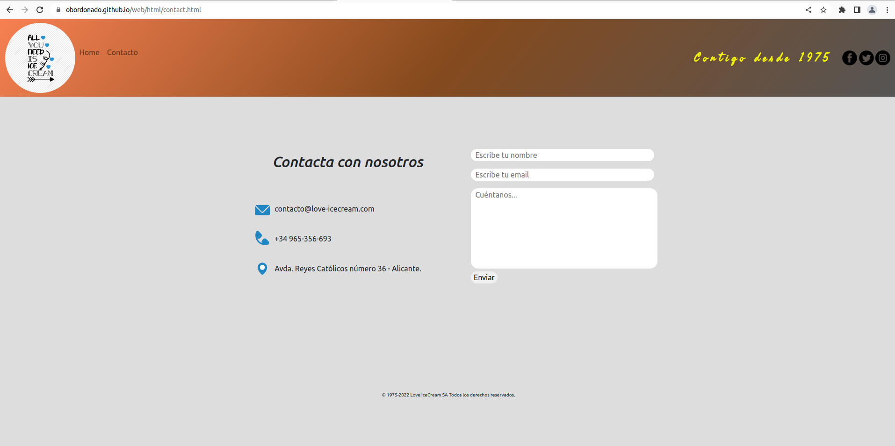
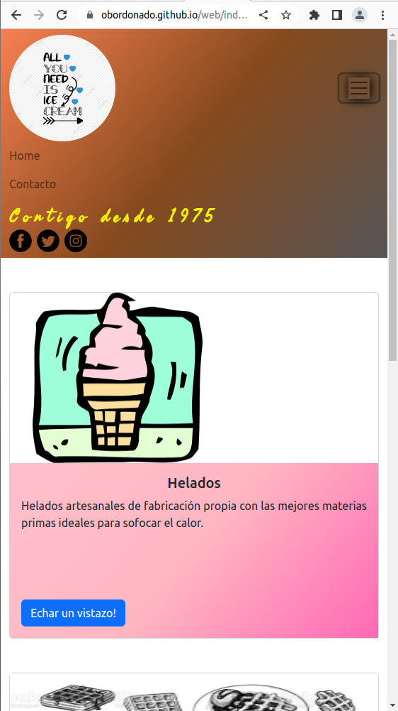
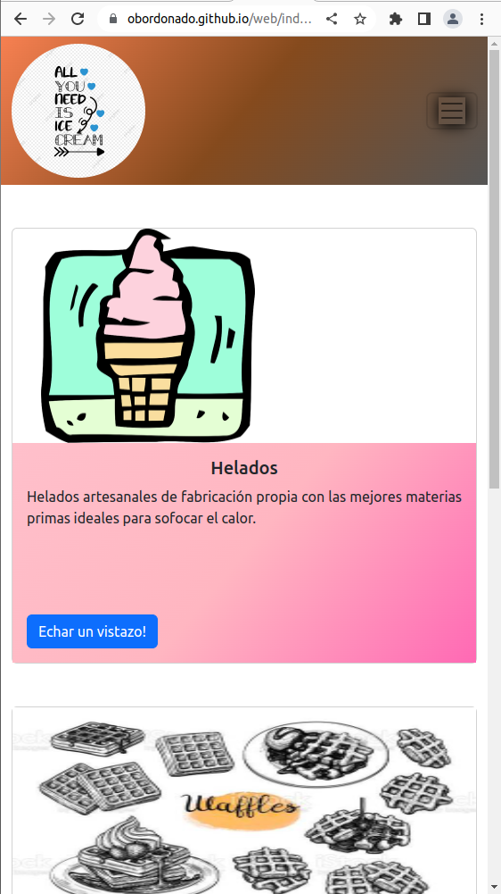

<pre>

         

</pre>

# 
Generic online store

> As a linux fan, I used Ubuntu to work on this project.

> The requirements were to make a responsive landing page and menu of any kind of restaurant / menu.

> Since everybody opted for a typical restaurant, I went for an Icecream shop.

> Since it's not connected to a DDBB, it's coded only in HTML and CSS.

> In the use of CSS, I've used Grid, Flex and BOOTSTRAP in different places, (mobile first) to make it fully responsive (navbar etc) 

> In the navbar you'll be able to use the "Home" and "Contacto" links that are fully operational.

> I've <b>deployed</b> the project in <b>Github Pages</b> so that anyone can take a quick look at the finished site.

> The third cards link (Niñ@s) will take you to the menu where you will find the menu for the little ones which includes a title, description and price. ;)

> I also added a button in order to buy any of the products. (Not connected to DDBB)

>
---

> <b>Landing page:</b> 

>
---
> <b>Menu Niñ@s</b>

>
---
> <b>Contact page:</b>

>
---
> <b>Responsive:</b>
By clicking the top right button, the menu will show or hide itself.

  

>### Thanks for visiting !!